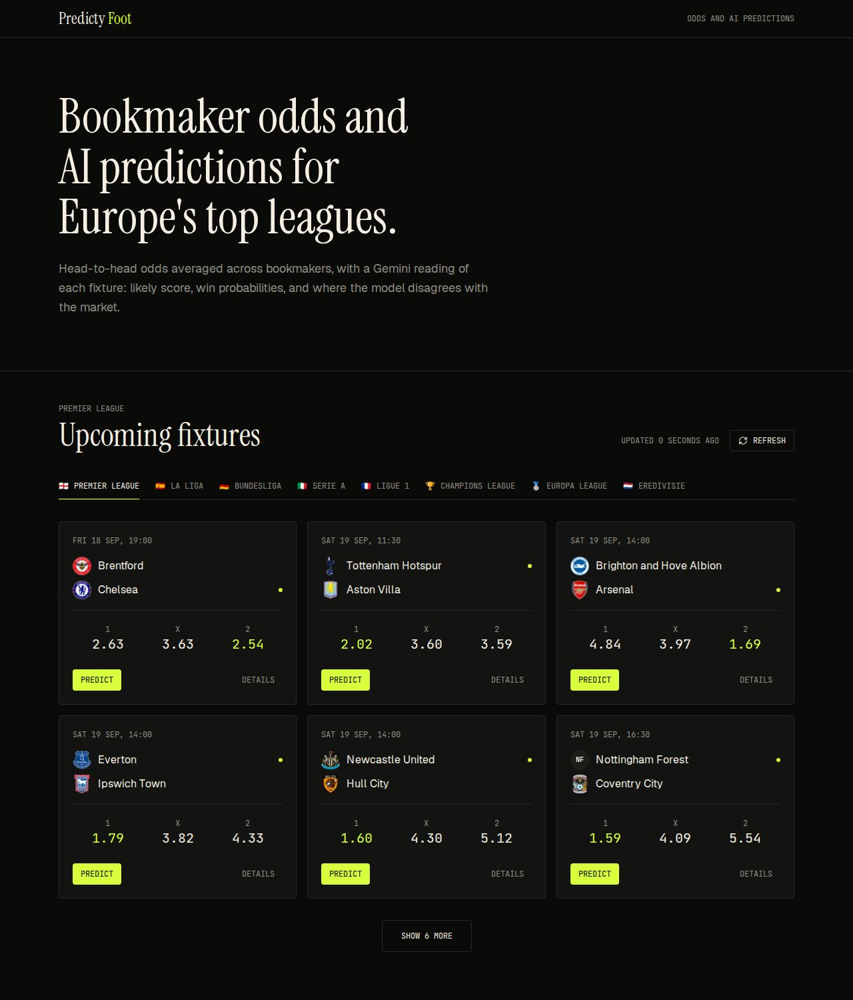
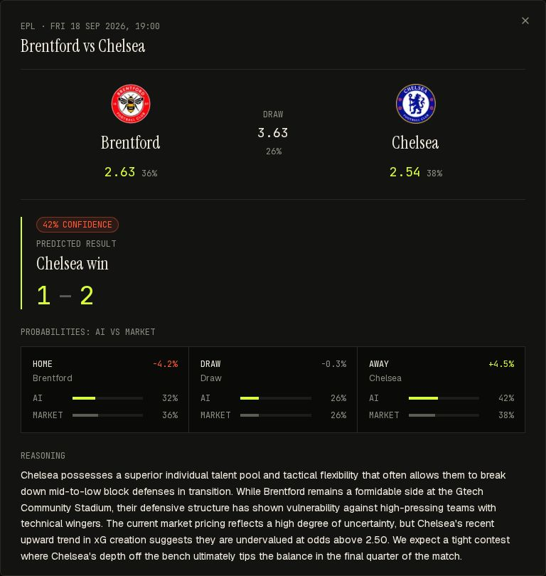
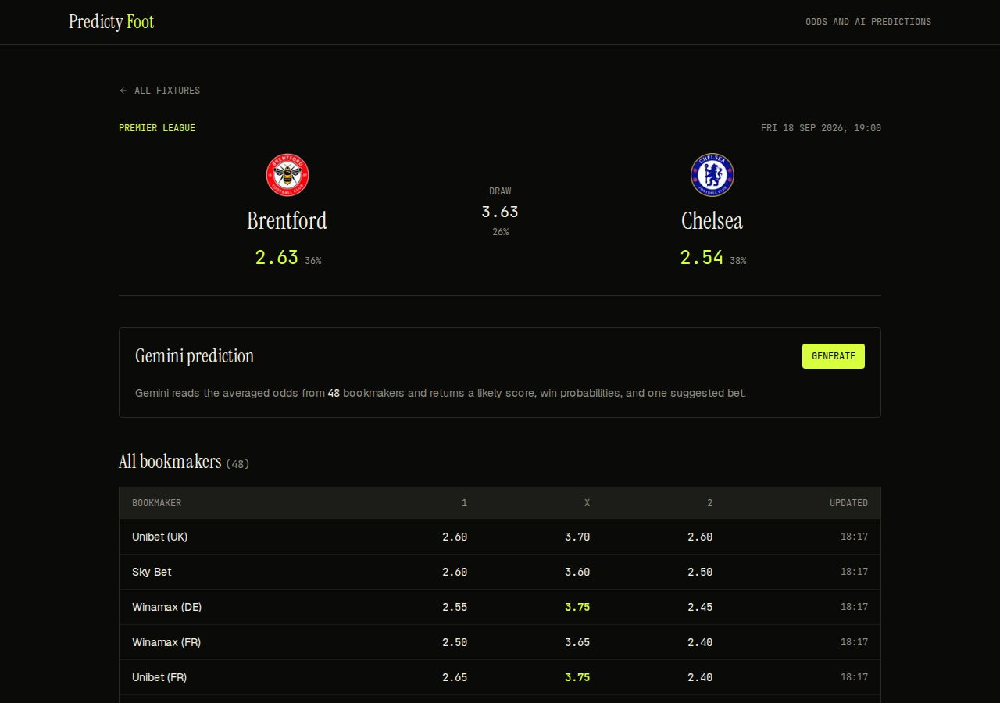
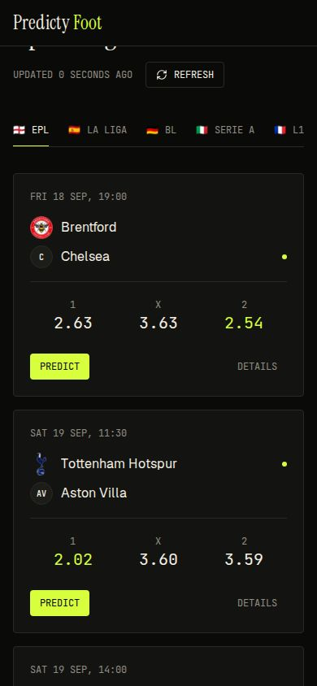
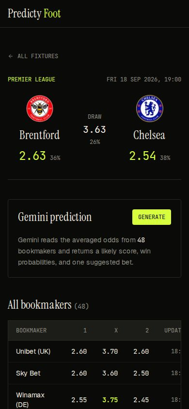

<p align="center">
  
</p>

<h1 align="center">Predicty Foot</h1>

<p align="center">
   <strong>Bookmaker odds and AI match predictions for Europe's top football leagues.</strong><br>
   <em>Odds from The Odds API, averaged across bookmakers. Predictions from Google Gemini.</em>
</p>

<p align="center">
  <a href="https://nextjs.org"></a>
  <a href="https://bun.sh"></a>
  <a href="https://tailwindcss.com"></a>
  <a href="https://github.com/kacigaya/predicty-foot/blob/main/LICENSE"></a>
</p>

Live at [pfoot.gayakaci.duckdns.org](https://pfoot.gayakaci.duckdns.org/).

## Features

- Upcoming fixtures for eight competitions: Premier League, La Liga, Bundesliga, Serie A, Ligue 1, Champions League, Europa League, Eredivisie
- Head-to-head odds averaged across every bookmaker The Odds API returns for the EU, UK and US regions, with implied win probabilities
- A Gemini prediction per fixture: predicted result and score, confidence, AI vs market probabilities with the edge on each outcome, reasoning, key factors, and one suggested bet
- Full bookmaker table per match with the best price per outcome highlighted
- Match detail page at `/matches/[id]` with the same prediction panel
- Team crests resolved through TheSportsDB with a static override table, cached for a day
- Odds cached for five minutes in memory and revalidated every minute by Next.js, so a refresh rarely costs an API call
- Per-route metadata, canonical URLs, and Open Graph tags
- Dark theme only: near-black surfaces, one lime accent, Instrument Serif for headings, Geist for text, JetBrains Mono for numbers

## Screenshots

### Desktop



Home: league tabs, then one card per fixture with averaged 1 X 2 odds and the market favourite marked.



Prediction dialog: confidence, predicted score, AI vs market probabilities with the edge per outcome, and the reasoning.



Match page: crests, averaged odds and implied probabilities, the prediction panel, and every bookmaker's prices.

### Mobile web

| Home | Match |
| --- | --- |
|  |  |

Crests in these screenshots come from TheSportsDB and Wikimedia.

## Tech stack

- Framework: Next.js 16 (Turbopack, App Router, server actions)
- UI: React 19, Tailwind CSS 4, Coss UI on Base UI, Lucide icons
- Styling: clsx, tailwind-merge, class-variance-authority
- Data: The Odds API (fixtures and h2h odds), TheSportsDB (crests)
- AI: `@google/generative-ai` with `gemini-3.1-flash-lite-preview`
- Language: TypeScript
- Runtime: Bun 1.4 for install and build, Node 22 in the production image

## Getting started

### Prerequisites

- Bun
- An [Odds API](https://the-odds-api.com/) key
- A [Gemini API](https://ai.google.dev/) key

Both keys are read at request time. Without `ODDS_API_KEY` the fixture list shows
an error state; without `GEMINI_API_KEY` the prediction button returns
"Prediction service unavailable". The rest of the page still renders.

### Installation

```bash
bun install
```

Create `.env.local`:

```env
ODDS_API_KEY=...
GEMINI_API_KEY=...
```

### Development

```bash
bun dev
```

Open [http://localhost:3000](http://localhost:3000).

### Checks

```bash
bun run lint
bunx tsc --noEmit
bun run build
```

There is no test suite. The build runs the TypeScript check.

### Project structure

```
app/
  page.tsx              # Home: hero and fixture board
  layout.tsx            # Fonts, metadata, pre-paint theme script, navbar, footer
  site.ts               # Canonical origin, site name, description
  actions/              # Server actions: getOdds, generatePrediction
  api/odds/             # JSON odds endpoint, rate limited
  api/team-logo/        # Crest lookup with alias and static tables
  components/           # Board, cards, prediction dialog and result
  lib/                  # Odds client and maths, Gemini client, leagues, rate limit
  matches/[id]/         # Match detail page and prediction panel
components/             # Navbar, footer, theme toggle
  ui/                   # Coss UI primitives on Base UI
lib/utils.ts            # cn() class merger
proxy.ts                # Per-request CSP nonce
public/                 # Icon and README screenshots
Dockerfile              # Bun build, Node standalone runner
```

## Security notes

- `proxy.ts` sends a per-request CSP. Scripts use a nonce with `strict-dynamic`;
  styles allow `unsafe-inline` because `next/image` and Base UI set `style`
  attributes, which cannot carry a nonce. `unsafe-eval` is added in development
  only.
- Server actions and `/api/odds` validate the league key against the eight
  configured competitions before calling the provider, and event ids against a
  character allowlist.
- Provider error bodies and the missing-key hint are logged server-side; the
  browser gets a generic message.
- `/api/odds` and `/api/team-logo` are rate limited per client IP, 60 requests
  a minute, in memory. The limiter keys on the first `X-Forwarded-For` entry,
  so the reverse proxy in front of the app must overwrite that header rather
  than append to it.
- Crest URLs are only accepted from `thesportsdb.com`, `r2.thesportsdb.com`
  and `upload.wikimedia.org`, matching `images.remotePatterns` and the CSP
  `img-src`.

## Deployment

The app needs a Node server: pages render per request, odds and predictions go
through server actions, and both API keys must stay server-side. It cannot be
exported statically, so GitHub Pages is out.

Production runs on Dokploy from the `Dockerfile` (`output: "standalone"` in
`next.config.ts`; keep the two in sync). `ODDS_API_KEY` and `GEMINI_API_KEY`
are runtime environment variables; nothing is needed at build time. Set
`NEXT_PUBLIC_SITE_URL` at build time only if the canonical origin changes.

## Notice

For entertainment only. Predictions are probabilistic, never guaranteed. Gamble
responsibly.

## License

MIT
